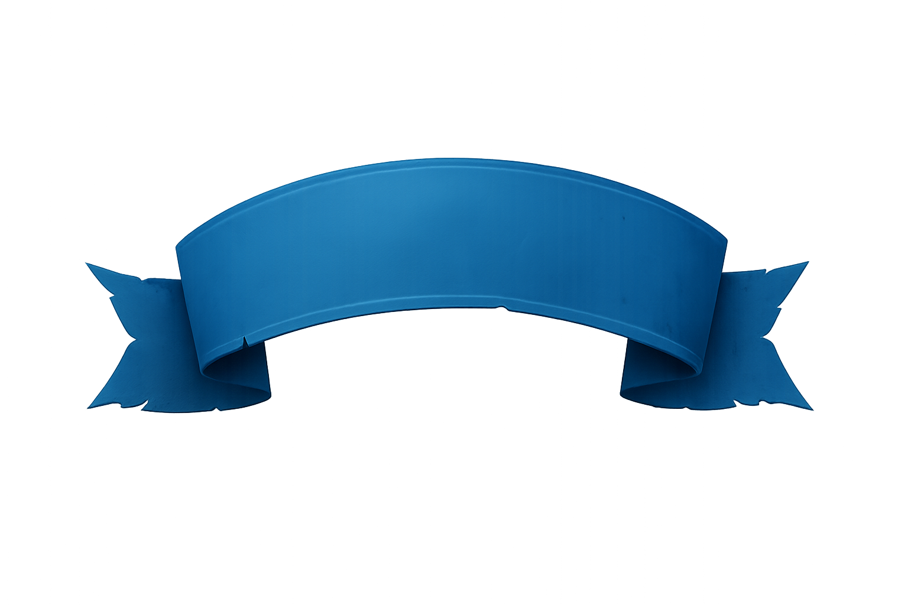

# project-3d-neglected-dungeon

## 프로젝트 개요

- 그리드 기반 절차 생성 던전과 실시간 전투를 결합한 3D 로그라이트 액션 게임입니다.
- 플레이어, 몬스터, UI, 던전 생성 로직을 모듈 단위로 구성해 확장성과 유지보수성을 확보했습니다.
- MVP(View/Presenter) 구조와 ScriptableObject 데이터를 통해 콘텐츠 추가 시 코드 변경을 최소화합니다.

### 주요 기술

- **엔진**: Unity 2022.3.62f2 (LTS)
- **아키텍처**: MVP 패턴, 계층형 모듈 구조
- **핵심 기능**: 절차적 던전 생성, 상태 머신 기반 AI, 오브젝트 풀링, NavMesh 기반 경로 탐색

---

## 목차

- [프로젝트 개요](#프로젝트-개요)
- [시스템 구성 요약](#시스템-구성-요약)
  - [아키텍처 개요](#아키텍처-개요)
  - [의존성 흐름](#의존성-흐름)
  - [파일 구조](#파일-구조)
- [핵심 플레이 흐름](#핵심-플레이-흐름)
- [스크린샷](#스크린샷)
- [스크립트 카탈로그](#스크립트-카탈로그)
- [License](#license)

## 시스템 구성 요약

### 아키텍처 개요

프로젝트는 **계층형 모듈 구조**와 **MVP 패턴**을 결합하여 확장성과 유지보수성을 확보했습니다.

#### 1. Managers 계층 (런타임 진입점)

- **`Managers`**: 싱글톤 진입점으로 모든 매니저를 초기화하고 전역 접근을 제공합니다.
  - `DungeonManager`: 던전 생성, 스테이지 진행, 몬스터 스폰 관리
  - `ObjectPoolManager`: 오브젝트 풀링으로 메모리 효율성 확보
  - `InventoryManager`: 장비/인벤토리 상태 및 이벤트 관리
- **특징**: `partial` 클래스와 `internal` 생성자로 `Managers`에서만 인스턴스화 가능하도록 캡슐화

#### 2. Gameplay Core 계층

- **Player**: `PlayerController`(이동/회전), `PlayerStateMachine`(상태 전환), `TargetController`(타겟팅), `PlayerWallet`(재화)
- **Monster**: `Monster` 베이스 클래스와 `MonsterStateMachine`으로 AI 행동 제어, `MonsterSpawner`로 웨이브 관리
- **Dungeon**: `MapGenerator`(그리드 기반 절차 생성), `Room`/`RoomConnectors`(방 연결), `Dungeon`(던전 엔티티)
- **Item**: `ItemSlot`/`EquipmentSlot`(UI 슬롯), `EquipmentController`(장비 교체 로직)

#### 3. UI/UX 계층 (MVP 패턴)

- **View**: UI 컴포넌트만 담당 (`CurDungeonView`, `HeaderView`, `StatView`, `ProfileView` 등)
- **Presenter**: View와 데이터 모델을 연결, 이벤트 중계 및 상태 동기화 (`*Presenter` 클래스들)
- **분리 원칙**: View는 UI 표시만, Presenter는 비즈니스 로직 처리

#### 4. Data 계층 (ScriptableObject)

- **구조**: `10_ScriptableObjects/00_Scripts/`에 SO 클래스 정의, `01_Data/`에 인스턴스 에셋
- **종류**: `DungeonData`, `MonsterData`, `PlayerStatData`, `ItemData` 등
- **장점**: 디자이너가 Unity 에디터에서 데이터 수정 가능, 코드 재컴파일 불필요

#### 5. Common/Utils 계층

- **Common**: `StateMachine`(범용 상태머신), `IAttackable`/`IPoolable`(인터페이스), `NavigationController`(AI 이동)
- **Utils**: `Logger`(커스텀 로깅), `Extensions`(확장 메서드), `CustomException`(예외 처리)

### 의존성 흐름

<!-- 의존성 흐름 다이어그램 이미지 추가 예정 -->

### 파일 구조

```
Assets/
├── 00_Scenes/                    # 씬 파일
│   └── MainScene/
│
├── 01_Scripts/                   # 스크립트 소스 (자세한 내용은 [스크립트 카탈로그](#스크립트-카탈로그) 참고)
│   ├── 00_Manager/               # 매니저 계층
│   ├── 01_Common/                # 공통 유틸리티
│   ├── 02_Player/                # 플레이어 로직 (+ State/)
│   ├── 03_Monster/               # 몬스터 로직 (+ State/)
│   ├── 04_Dungeon/               # 던전 생성
│   ├── 05_Item/                  # 아이템/장비
│   ├── 10_View/                  # MVP - View
│   ├── 11_Presenter/             # MVP - Presenter
│   └── 99_Utils/                 # 유틸리티
│
├── 02_Prefabs/                   # 프리팹
│   ├── 00_Core/                  # 핵심 오브젝트 (Managers, Player)
│   ├── 01_Dungeon/               # 던전 관련 (Room, Corridor, Monster)
│   └── 10_UI/                    # UI 프리팹
│
├── 03_Artworks/                  # 아트워크 (UI 아이콘, 스크린샷)
│
├── 04_Animations/                # 애니메이션 컨트롤러
│
├── 10_ScriptableObjects/         # 데이터 계층
│   ├── 00_Scripts/               # SO 클래스 정의
│   └── 01_Data/                  # SO 인스턴스 에셋
│
└── 30_Externals/                 # 외부 에셋 (폰트, 패키지, 3D 모델 등)
```

## 핵심 플레이 흐름

1. `DungeonManager`가 `MapGenerator`/`RoomConnectors`를 호출해 그리드 기반 던전을 구성하고, `MonsterSpawner`를 통해 웨이브를 준비합니다.
2. 플레이어 입력은 `PlayerController` → `PlayerStateMachine` → `PlayerAnimationData` 순서로 전달되며, 목표 탐색은 `TargetController`에서 수행합니다.
3. 몬스터는 `MonsterStateMachine`과 `NavigationController`를 통해 패스파인딩/공격을 수행하고, `IAttackable` 인터페이스로 전투 이벤트가 연결됩니다.
4. 전투/보상 결과는 `PlayerWallet`, `EquipmentController`, `StatPresenter` 등 UI와 Presenter에 반영되어 즉시 표시됩니다.

## 스크린샷

| 던전 보상 UI 예시                                     |
| ----------------------------------------------------- |
|  |

## 스크립트 카탈로그

### Manager

> 매니저 Scripts
>
> partial 클래스 & internal 생성자로 `Managers`에서만 초기화 가능하도록 설정

<table style="width: 720px; border-collapse: collapse;">
  <thead>
    <tr>
      <th style="width: 200px; border: 1px solid #ccc; padding: 6px;">Name</th>
      <th style="width: 520px; border: 1px solid #ccc; padding: 6px;">Description</th>
    </tr>
  </thead>
  <tbody>
    <tr>
      <td style="border: 1px solid #ccc; padding: 6px;">
        <a href="./Assets/01_Scripts/00_Manager/Managers.cs">Managers.cs</a>
      </td>
      <td style="border: 1px solid #ccc; padding: 6px;">
        개별 매니저를 초기화·보유하는 최상위 진입점
      </td>
    </tr>
    <tr>
      <td style="border: 1px solid #ccc; padding: 6px;">
        <a href="./Assets/01_Scripts/00_Manager/DungeonManager.cs">DungeonManager.cs</a>
      </td>
      <td style="border: 1px solid #ccc; padding: 6px;">
        던전 진행 상태, 웨이브, 난이도 흐름 제어
      </td>
    </tr>
    <tr>
      <td style="border: 1px solid #ccc; padding: 6px;">
        <a href="./Assets/01_Scripts/00_Manager/InventoryManager.cs">InventoryManager.cs</a>
      </td>
      <td style="border: 1px solid #ccc; padding: 6px;">
        장비/소모품 보유 상태 및 변경 이벤트 관리
      </td>
    </tr>
    <tr>
      <td style="border: 1px solid #ccc; padding: 6px;">
        <a href="./Assets/01_Scripts/00_Manager/ObjectPoolManager.cs">ObjectPoolManager.cs</a>
      </td>
      <td style="border: 1px solid #ccc; padding: 6px;">
        풀링 리소스 예약·재사용·해제를 담당
      </td>
    </tr>
  </tbody>
</table>

### Common

> 공통으로 사용되는 Scripts

<table style="width: 720px; border-collapse: collapse;">
  <thead>
    <tr>
      <th style="width: 200px; border: 1px solid #ccc; padding: 6px;">Name</th>
      <th style="width: 520px; border: 1px solid #ccc; padding: 6px;">Description</th>
    </tr>
  </thead>
  <tbody>
    <tr>
      <td style="border: 1px solid #ccc; padding: 6px;">
        <a href="./Assets/01_Scripts/01_Common/Define.cs">Define.cs</a>
      </td>
      <td style="border: 1px solid #ccc; padding: 6px;">
        전역 상수와 공용 설정을 정리
      </td>
    </tr>
    <tr>
      <td style="border: 1px solid #ccc; padding: 6px;">
        <a href="./Assets/01_Scripts/01_Common/Enum.cs">Enum.cs</a>
      </td>
      <td style="border: 1px solid #ccc; padding: 6px;">
        게임에서 사용하는 열거형 묶음
      </td>
    </tr>
    <tr>
      <td style="border: 1px solid #ccc; padding: 6px;">
        <a href="./Assets/01_Scripts/01_Common/IAttackable.cs">IAttackable.cs</a>
      </td>
      <td style="border: 1px solid #ccc; padding: 6px;">
        피격/체력 처리 인터페이스
      </td>
    </tr>
    <tr>
      <td style="border: 1px solid #ccc; padding: 6px;">
        <a href="./Assets/01_Scripts/01_Common/IPoolable.cs">IPoolable.cs</a>
      </td>
      <td style="border: 1px solid #ccc; padding: 6px;">
        오브젝트 풀 입출고 규약
      </td>
    </tr>
    <tr>
      <td style="border: 1px solid #ccc; padding: 6px;">
        <a href="./Assets/01_Scripts/01_Common/NavigationController.cs">NavigationController.cs</a>
      </td>
      <td style="border: 1px solid #ccc; padding: 6px;">
        AI NavMesh 이동 컨트롤러
      </td>
    </tr>
    <tr>
      <td style="border: 1px solid #ccc; padding: 6px;">
        <a href="./Assets/01_Scripts/01_Common/StateMachine.cs">StateMachine.cs</a>
      </td>
      <td style="border: 1px solid #ccc; padding: 6px;">
        범용 상태 머신 프레임워크
      </td>
    </tr>
  </tbody>
</table>

### Player

> 플레이어와 관련된 Scripts

<table style="width: 720px; border-collapse: collapse;">
  <thead>
    <tr>
      <th style="width: 200px; border: 1px solid #ccc; padding: 6px;">Name</th>
      <th style="width: 520px; border: 1px solid #ccc; padding: 6px;">Description</th>
    </tr>
  </thead>
  <tbody>
    <tr>
      <td style="border: 1px solid #ccc; padding: 6px;">
        <a href="./Assets/01_Scripts/02_Player/Player.cs">Player.cs</a>
      </td>
      <td style="border: 1px solid #ccc; padding: 6px;">
        플레이어 전역 상태를 보관하는 컨테이너
      </td>
    </tr>
    <tr>
      <td style="border: 1px solid #ccc; padding: 6px;">
        <a href="./Assets/01_Scripts/02_Player/PlayerAnimationData.cs">PlayerAnimationData.cs</a>
      </td>
      <td style="border: 1px solid #ccc; padding: 6px;">
        플레이어 애니메이터 파라미터와 Hash를 관리
      </td>
    </tr>
    <tr>
      <td style="border: 1px solid #ccc; padding: 6px;">
        <a href="./Assets/01_Scripts/02_Player/PlayerAnimationEventRelay.cs">PlayerAnimationEventRelay.cs</a>
      </td>
      <td style="border: 1px solid #ccc; padding: 6px;">
        플레이어 애니메이션 이벤트 전달자
      </td>
    </tr>
    <tr>
      <td style="border: 1px solid #ccc; padding: 6px;">
        <a href="./Assets/01_Scripts/02_Player/PlayerCondition.cs">PlayerCondition.cs</a>
      </td>
      <td style="border: 1px solid #ccc; padding: 6px;">
        체력·기력 등 플레이어 컨디션 관리
      </td>
    </tr>
    <tr>
      <td style="border: 1px solid #ccc; padding: 6px;">
        <a href="./Assets/01_Scripts/02_Player/PlayerController.cs">PlayerController.cs</a>
      </td>
      <td style="border: 1px solid #ccc; padding: 6px;">
        CharacterController 기반 이동/회전 처리
      </td>
    </tr>
    <tr>
      <td style="border: 1px solid #ccc; padding: 6px;">
        <a href="./Assets/01_Scripts/02_Player/PlayerStateMachine.cs">PlayerStateMachine.cs</a>
      </td>
      <td style="border: 1px solid #ccc; padding: 6px;">
        이동/전투 상태 전환과 데이터 저장
      </td>
    </tr>
    <tr>
      <td style="border: 1px solid #ccc; padding: 6px;">
        <a href="./Assets/01_Scripts/02_Player/PlayerWallet.cs">PlayerWallet.cs</a>
      </td>
      <td style="border: 1px solid #ccc; padding: 6px;">
        골드·재화 보유량 추적 및 이벤트 발행
      </td>
    </tr>
    <tr>
      <td style="border: 1px solid #ccc; padding: 6px;">
        <a href="./Assets/01_Scripts/02_Player/TargetController.cs">TargetController.cs</a>
      </td>
      <td style="border: 1px solid #ccc; padding: 6px;">
        플레이어가 공격할 타깃 스캔과 타겟 설정 관리
      </td>
    </tr>
  </tbody>
</table>

#### State

> 플레이어 상태 관리를 위한 Scripts

<table style="width: 720px; border-collapse: collapse;">
  <thead>
    <tr>
      <th style="width: 200px; border: 1px solid #ccc; padding: 6px;">Name</th>
      <th style="width: 520px; border: 1px solid #ccc; padding: 6px;">Description</th>
    </tr>
  </thead>
  <tbody>
    <tr>
      <td style="border: 1px solid #ccc; padding: 6px;">
        <a href="./Assets/01_Scripts/02_Player/State/PlayerBaseState.cs">PlayerBaseState.cs</a>
      </td>
      <td style="border: 1px solid #ccc; padding: 6px;">
        플레이어 상태 공통 로직 베이스
      </td>
    </tr>
    <tr>
      <td style="border: 1px solid #ccc; padding: 6px;">
        <a href="./Assets/01_Scripts/02_Player/State/PlayerGroundState.cs">PlayerGroundState.cs</a>
      </td>
      <td style="border: 1px solid #ccc; padding: 6px;">
        지상 서브 상태머신 제어 (Base 자식 | Idle/Chase 부모)
      </td>
    </tr>
    <tr>
      <td style="border: 1px solid #ccc; padding: 6px;">
        <a href="./Assets/01_Scripts/02_Player/State/PlayerIdleState.cs">PlayerIdleState.cs</a>
      </td>
      <td style="border: 1px solid #ccc; padding: 6px;">
        Idle 애니메이션 및 입력 대기 처리
      </td>
    </tr>
    <tr>
      <td style="border: 1px solid #ccc; padding: 6px;">
        <a href="./Assets/01_Scripts/02_Player/State/PlayerChaseState.cs">PlayerChaseState.cs</a>
      </td>
      <td style="border: 1px solid #ccc; padding: 6px;">
        추적/이동 애니메이션 상태
      </td>
    </tr>
    <tr>
      <td style="border: 1px solid #ccc; padding: 6px;">
        <a href="./Assets/01_Scripts/02_Player/State/PlayerAttackState.cs">PlayerAttackState.cs</a>
      </td>
      <td style="border: 1px solid #ccc; padding: 6px;">
        공격 서브 상태머신과 애니메이션 관리
      </td>
    </tr>
  </tbody>
</table>

## Monster

> 몬스터 Scripts

<table style="width: 720px; border-collapse: collapse;">
  <thead>
    <tr>
      <th style="width: 200px; border: 1px solid #ccc; padding: 6px;">Name</th>
      <th style="width: 520px; border: 1px solid #ccc; padding: 6px;">Description</th>
    </tr>
  </thead>
  <tbody>
    <tr>
      <td style="border: 1px solid #ccc; padding: 6px;">
        <a href="./Assets/01_Scripts/03_Monster/Monster.cs">Monster.cs</a>
      </td>
      <td style="border: 1px solid #ccc; padding: 6px;">
        몬스터 기본 스탯·행동 공통 베이스
      </td>
    </tr>
    <tr>
      <td style="border: 1px solid #ccc; padding: 6px;">
        <a href="./Assets/01_Scripts/03_Monster/MonsterAnimationData.cs">MonsterAnimationData.cs</a>
      </td>
      <td style="border: 1px solid #ccc; padding: 6px;">
        몬스터 애니메이터 파라미터/Hash 관리
      </td>
    </tr>
    <tr>
      <td style="border: 1px solid #ccc; padding: 6px;">
        <a href="./Assets/01_Scripts/03_Monster/MonsterSpawner.cs">MonsterSpawner.cs</a>
      </td>
      <td style="border: 1px solid #ccc; padding: 6px;">
        몬스터 풀 / 던전 맵 내부 스폰 관리
      </td>
    </tr>
    <tr>
      <td style="border: 1px solid #ccc; padding: 6px;">
        <a href="./Assets/01_Scripts/03_Monster/MonsterStateMachine.cs">MonsterStateMachine.cs</a>
      </td>
      <td style="border: 1px solid #ccc; padding: 6px;">
        몬스터 애니메이션 상태머신
      </td>
    </tr>
    <tr>
      <td style="border: 1px solid #ccc; padding: 6px;">
        <a href="./Assets/01_Scripts/03_Monster/SkeletonWarrior.cs">SkeletonWarrior.cs</a>
      </td>
      <td style="border: 1px solid #ccc; padding: 6px;">
        몬스터: 스켈레톤 전사 (Monster 상속)
      </td>
    </tr>
  </tbody>
</table>

#### State

> 몬스터 상태 관리를 위한 Scripts

<table style="width: 720px; border-collapse: collapse;">
  <thead>
    <tr>
      <th style="width: 200px; border: 1px solid #ccc; padding: 6px;">Name</th>
      <th style="width: 520px; border: 1px solid #ccc; padding: 6px;">Description</th>
    </tr>
  </thead>
  <tbody>
    <tr>
      <td style="border: 1px solid #ccc; padding: 6px;">
        <a href="./Assets/01_Scripts/03_Monster/State/MonsterBaseState.cs">MonsterBaseState.cs</a>
      </td>
      <td style="border: 1px solid #ccc; padding: 6px;">
        몬스터 상태 공통 로직 베이스
      </td>
    </tr>
    <tr>
      <td style="border: 1px solid #ccc; padding: 6px;">
        <a href="./Assets/01_Scripts/03_Monster/State/MonsterIdleState.cs">MonsterIdleState.cs</a>
      </td>
      <td style="border: 1px solid #ccc; padding: 6px;">
        몬스터 Idle 애니메이션 상태
      </td>
    </tr>
  </tbody>
</table>

## Dungeon

> 던전 자동 생성을 위한 Scripts

<table style="width: 720px; border-collapse: collapse;">
  <thead>
    <tr>
      <th style="width: 200px; border: 1px solid #ccc; padding: 6px;">Name</th>
      <th style="width: 520px; border: 1px solid #ccc; padding: 6px;">Description</th>
    </tr>
  </thead>
  <tbody>
    <tr>
      <td style="border: 1px solid #ccc; padding: 6px;">
        <a href="./Assets/01_Scripts/04_Dungeon/MapGenerator.cs">MapGenerator.cs</a>
      </td>
      <td style="border: 1px solid #ccc; padding: 6px;">
        그리드 기반 절차적 던전 생성기
      </td>
    </tr>
    <tr>
      <td style="border: 1px solid #ccc; padding: 6px;">
        <a href="./Assets/01_Scripts/04_Dungeon/RoomConnectors.cs">RoomConnectors.cs</a>
      </td>
      <td style="border: 1px solid #ccc; padding: 6px;">
        방 간 도어 좌표·연결 정보
      </td>
    </tr>
    <tr>
      <td style="border: 1px solid #ccc; padding: 6px;">
        <a href="./Assets/01_Scripts/04_Dungeon/Dungeon.cs">Dungeon.cs</a>
      </td>
      <td style="border: 1px solid #ccc; padding: 6px;">
        던전 엔티티 데이터/상태 관리
      </td>
    </tr>
    <tr>
      <td style="border: 1px solid #ccc; padding: 6px;">
        <a href="./Assets/01_Scripts/04_Dungeon/Room.cs">Room.cs</a>
      </td>
      <td style="border: 1px solid #ccc; padding: 6px;">
        개별 룸 구조 및 전개 로직
      </td>
    </tr>
  </tbody>
</table>

## Item

> 아이템 관련 Scripts

<table style="width: 720px; border-collapse: collapse;">
  <thead>
    <tr>
      <th style="width: 200px; border: 1px solid #ccc; padding: 6px;">Name</th>
      <th style="width: 520px; border: 1px solid #ccc; padding: 6px;">Description</th>
    </tr>
  </thead>
  <tbody>
    <tr>
      <td style="border: 1px solid #ccc; padding: 6px;">
        <a href="./Assets/01_Scripts/05_Item/ItemSlot.cs">ItemSlot.cs</a>
      </td>
      <td style="border: 1px solid #ccc; padding: 6px;">
        공용 아이템 슬롯 UI 추상 클래스
      </td>
    </tr>
    <tr>
      <td style="border: 1px solid #ccc; padding: 6px;">
        <a href="./Assets/01_Scripts/05_Item/EquipmentSlot.cs">EquipmentSlot.cs</a>
      </td>
      <td style="border: 1px solid #ccc; padding: 6px;">
        장비 타입별 슬롯 처리 (ItemSlot 상속)
      </td>
    </tr>
    <tr>
      <td style="border: 1px solid #ccc; padding: 6px;">
        <a href="./Assets/01_Scripts/05_Item/EquipmentController.cs">EquipmentController.cs</a>
      </td>
      <td style="border: 1px solid #ccc; padding: 6px;">
        장비 슬롯 그룹 관리 및 장비 교체 로직
      </td>
    </tr>
  </tbody>
</table>

## View

> View Scripts

<table style="width: 720px; border-collapse: collapse;">
  <thead>
    <tr>
      <th style="width: 200px; border: 1px solid #ccc; padding: 6px;">Name</th>
      <th style="width: 520px; border: 1px solid #ccc; padding: 6px;">Description</th>
    </tr>
  </thead>
  <tbody>
    <tr>
      <td style="border: 1px solid #ccc; padding: 6px;">
        <a href="./Assets/01_Scripts/10_View/CurDungeonView.cs">CurDungeonView.cs</a>
      </td>
      <td style="border: 1px solid #ccc; padding: 6px;">
        현재 던전 진행 정보 표시
      </td>
    </tr>
    <tr>
      <td style="border: 1px solid #ccc; padding: 6px;">
        <a href="./Assets/01_Scripts/10_View/DungeonButtonView.cs">DungeonButtonView.cs</a>
      </td>
      <td style="border: 1px solid #ccc; padding: 6px;">
        던전 선택 UI
      </td>
    </tr>
    <tr>
      <td style="border: 1px solid #ccc; padding: 6px;">
        <a href="./Assets/01_Scripts/10_View/EquipmentItemView.cs">EquipmentItemView.cs</a>
      </td>
      <td style="border: 1px solid #ccc; padding: 6px;">
        장비 장착 UI
      </td>
    </tr>
    <tr>
      <td style="border: 1px solid #ccc; padding: 6px;">
        <a href="./Assets/01_Scripts/10_View/HeaderView.cs">HeaderView.cs</a>
      </td>
      <td style="border: 1px solid #ccc; padding: 6px;">
        상단 재화/자원 표시
      </td>
    </tr>
    <tr>
      <td style="border: 1px solid #ccc; padding: 6px;">
        <a href="./Assets/01_Scripts/10_View/ProfileView.cs">ProfileView.cs</a>
      </td>
      <td style="border: 1px solid #ccc; padding: 6px;">
        프로필 UI
      </td>
    </tr>
    <tr>
      <td style="border: 1px solid #ccc; padding: 6px;">
        <a href="./Assets/01_Scripts/10_View/StatView.cs">StatView.cs</a>
      </td>
      <td style="border: 1px solid #ccc; padding: 6px;">
        현재 스탯 표시
      </td>
    </tr>
    <tr>
      <td style="border: 1px solid #ccc; padding: 6px;">
        <a href="./Assets/01_Scripts/10_View/ViewInterface.cs">ViewInterface.cs</a>
      </td>
      <td style="border: 1px solid #ccc; padding: 6px;">
        공통 View 인터페이스
      </td>
    </tr>
  </tbody>
</table>

## Presenter

> Presenter Scripts

<table style="width: 720px; border-collapse: collapse;">
  <thead>
    <tr>
      <th style="width: 200px; border: 1px solid #ccc; padding: 6px;">Name</th>
      <th style="width: 520px; border: 1px solid #ccc; padding: 6px;">Description</th>
    </tr>
  </thead>
  <tbody>
    <tr>
      <td style="border: 1px solid #ccc; padding: 6px;">
        <a href="./Assets/01_Scripts/11_Presenter/CurDungeonPresenter.cs">CurDungeonPresenter.cs</a>
      </td>
      <td style="border: 1px solid #ccc; padding: 6px;">
        현재 던전과 관련된 데이터를 연결하는 Presenter
      </td>
    </tr>
    <tr>
      <td style="border: 1px solid #ccc; padding: 6px;">
        <a href="./Assets/01_Scripts/11_Presenter/EquipmentItemPresenter.cs">EquipmentItemPresenter.cs</a>
      </td>
      <td style="border: 1px solid #ccc; padding: 6px;">
        장비 장착 아이템과 관련된 데이터를 연결하는 Presenter
      </td>
    </tr>
    <tr>
      <td style="border: 1px solid #ccc; padding: 6px;">
        <a href="./Assets/01_Scripts/11_Presenter/HeaderPresenter.cs">HeaderPresenter.cs</a>
      </td>
      <td style="border: 1px solid #ccc; padding: 6px;">
        UI 상단 재화 뷰(HeaderView)와 관련된 데이터를 연결하는 Presenter
      </td>
    </tr>
    <tr>
      <td style="border: 1px solid #ccc; padding: 6px;">
        <a href="./Assets/01_Scripts/11_Presenter/ProfilePresenter.cs">ProfilePresenter.cs</a>
      </td>
      <td style="border: 1px solid #ccc; padding: 6px;">
        ProfileView와 관련 데이터를 연결하는 Presenter
      </td>
    </tr>
    <tr>
      <td style="border: 1px solid #ccc; padding: 6px;">
        <a href="./Assets/01_Scripts/11_Presenter/StatPresenter.cs">StatPresenter.cs</a>
      </td>
      <td style="border: 1px solid #ccc; padding: 6px;">
        StatView와 스탯 관련 데이터를 연결하는 Presenter
      </td>
    </tr>
  </tbody>
</table>

## Scriptable Object

> SO Scripts

<table style="width: 720px; border-collapse: collapse;">
  <thead>
    <tr>
      <th style="width: 200px; border: 1px solid #ccc; padding: 6px;">Name</th>
      <th style="width: 520px; border: 1px solid #ccc; padding: 6px;">Description</th>
    </tr>
  </thead>
  <tbody>
    <tr>
      <td style="border: 1px solid #ccc; padding: 6px;">
        <a href="./Assets/10_ScriptableObjects/00_Scripts/DungeonData.cs">DungeonData.cs</a>
      </td>
      <td style="border: 1px solid #ccc; padding: 6px;">
        던전에 포함되는 스테이지와 그 스테이지에 소환될 Entity와 관련된 정보<br/>
        던전 - 스테이지 - 소환 몬스터 (일반, 보스) 정보
      </td>
    </tr>
    <tr>
      <td style="border: 1px solid #ccc; padding: 6px;">
        <a href="./Assets/10_ScriptableObjects/00_Scripts/MonsterData.cs">MonsterData.cs</a>
      </td>
      <td style="border: 1px solid #ccc; padding: 6px;">
        몬스터 타입, 스탯 정보
      </td>
    </tr>
    <tr>
      <td style="border: 1px solid #ccc; padding: 6px;">
        <a href="./Assets/10_ScriptableObjects/00_Scripts/ObstacleData.cs">ObstacleData.cs</a>
      </td>
      <td style="border: 1px solid #ccc; padding: 6px;">
        파괴 가능한 장애물 정보
      </td>
    </tr>
    <tr>
      <td style="border: 1px solid #ccc; padding: 6px;">
        <a href="./Assets/10_ScriptableObjects/00_Scripts/ItemData.cs">ItemData.cs</a>
      </td>
      <td style="border: 1px solid #ccc; padding: 6px;">
        아이템 기본 정보 (장비/소모품 타입, 아이콘, 스탯 등)
      </td>
    </tr>
    <tr>
      <td style="border: 1px solid #ccc; padding: 6px;">
        <a href="./Assets/10_ScriptableObjects/00_Scripts/CorridorSetData.cs">CorridorSetData.cs</a>
      </td>
      <td style="border: 1px solid #ccc; padding: 6px;">
        던전 방 간 연결 통로 프리팹 세트
      </td>
    </tr>
    <tr>
      <td style="border: 1px solid #ccc; padding: 6px;">
        <a href="./Assets/10_ScriptableObjects/00_Scripts/PlayerStateData.cs">PlayerStateData.cs</a>
      </td>
      <td style="border: 1px solid #ccc; padding: 6px;">
        플레이어 애니메이션 상태 정보
      </td>
    </tr>
    <tr>
      <td style="border: 1px solid #ccc; padding: 6px;">
        <a href="./Assets/10_ScriptableObjects/00_Scripts/Stat/MonsterStatData.cs">MonsterStatData.cs</a>
      </td>
      <td style="border: 1px solid #ccc; padding: 6px;">
        몬스터 스탯 정보
      </td>
    </tr>
    <tr>
      <td style="border: 1px solid #ccc; padding: 6px;">
        <a href="./Assets/10_ScriptableObjects/00_Scripts/Stat/PlayerStatData.cs">PlayerStatData.cs</a>
      </td>
      <td style="border: 1px solid #ccc; padding: 6px;">
        플레이어 스탯 정보
      </td>
    </tr>
  </tbody>
</table>

## Utils

> Helper Scripts

<table style="width: 720px; border-collapse: collapse;">
  <thead>
    <tr>
      <th style="width: 200px; border: 1px solid #ccc; padding: 6px;">Name</th>
      <th style="width: 520px; border: 1px solid #ccc; padding: 6px;">Description</th>
    </tr>
  </thead>
  <tbody>
    <tr>
      <td style="border: 1px solid #ccc; padding: 6px;">
        <a href="./Assets/01_Scripts/99_Utils/CustomException.cs">CustomException.cs</a>
      </td>
      <td style="border: 1px solid #ccc; padding: 6px;">
        커스텀 에러 모음
      </td>
    </tr>
    <tr>
      <td style="border: 1px solid #ccc; padding: 6px;">
        <a href="./Assets/01_Scripts/99_Utils/Extenstions.cs">Extenstions.cs</a>
      </td>
      <td style="border: 1px solid #ccc; padding: 6px;">
        C# 확장 클래스 모음
      </td>
    </tr>
    <tr>
      <td style="border: 1px solid #ccc; padding: 6px;">
        <a href="./Assets/01_Scripts/99_Utils/Logger.cs">Logger.cs</a>
      </td>
      <td style="border: 1px solid #ccc; padding: 6px;">
        커스텀 로거
      </td>
    </tr>
  </tbody>
</table>

## License

일부 리소스는 외부 라이선스를 포함합니다.
자세한 내용은 [ASSETS_LICENSE.txt](./Assets/30_Externals/ASSETS_LICENSE.txt)를 참고하세요.
